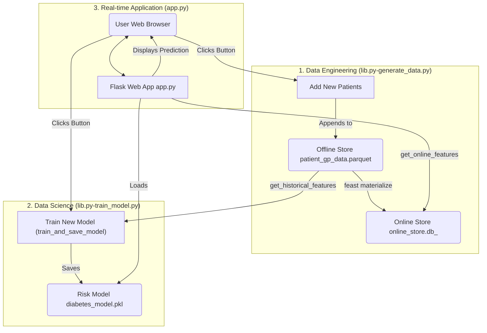


-----

# NHS Diabetes Risk Calculator (Feature Store Demo)

This project is a functional, interactive web application that demonstrates the **Feature Store** approach in a healthcare context. It uses a synthetic dataset of patient records to train a diabetes risk model and provides a simple web interface to get real-time predictions.

The core idea is to show how a feature store separates the **data engineering** (creating features like "BMI") from the **data science** (training models) and the **application** (getting a real-time risk score). This creates a "single source of truth" for features, ensuring that the data used to train a model is the same as the data used for a real-time prediction.

This demo uses:

  * **Feast:** An open-source feature store.
  * **Flask:** A lightweight Python web server.
  * **Scikit-learn:** For training the risk model.
  * **Parquet / SQLite:** As the offline (training) and online (real-time) databases.

## System Architecture

The application demonstrates the full MLOps loop, from data generation to real-time inference.



-----

## Project Structure

Your repository should contain the following key files:

  * **`app.py`**: The main Flask web server.
  * **`lib.py`**: A library containing all core logic for data generation and model training.
  * **`check_population.py`**: A utility script to analyze the risk distribution of your patient database.
  * **`generate_data.py`**: A helper script to manually run data generation (optional, can be done from the app).
  * **`train_model.py`**: A helper script to manually run model training (optional, can be done from the app).
  * **`templates/index.html`**: The web page template.
  * **`nhs_risk_calculator/`**: The Feast feature store repository.
      * **`definitions.py`**: The formal definitions of our patient features.
      * **`feature_store.yaml`**: The Feast configuration file.
  * **`.gitignore`**: (Recommended) To exclude generated files (`*.db`, `*.pkl`, `*.parquet`, `.venv/`) from GitHub.

-----

## Local PC Setup

Follow these steps to get the application running locally.

1.  **Clone the Repository:**

    ```bash
    git clone <your-repo-url>
    cd <your-repo-name>
    ```

2.  **Create a Virtual Environment:**

    ```bash
    python -m venv .venv
    ```

3.  **Activate the Environment:**

      * On Windows:
        ```bash
        .venv\Scripts\activate
        ```
      * On macOS/Linux:
        ```bash
        source .venv/bin/activate
        ```

4.  **Install Required Packages:**

    ```bash
    pip install feast pandas faker scikit-learn flask joblib
    ```

5.  **Generate Initial Data:**
    You must create an initial dataset before the app can run. This script creates the first batch of patients, registers them with Feast, and populates the databases.

    ```bash
    python generate_data.py
    ```

6.  **Train the First Model:**
    Now that you have data, you must train the first version of the risk model.

    ```bash
    python train_model.py
    ```

7.  **Run the Web App:**
    You're all set. Start the Flask server:

    ```bash
    python app.py
    ```

    Now, open `http://127.0.0.1:5000` in your web browser.

-----

## Using the Application

The web app provides an interactive way to simulate the MLOps lifecycle.

### 1\. Calculate Patient Risk (The "GP View")

This is the main function of the app.

  * **Action:** Enter a Patient ID (e.g., 1-500) and click "Calculate Risk".
  * **What it does:** The app queries the **online store (SQLite)** for the *latest* features for that patient, feeds them into the loaded **model (.pkl file)**, and displays the resulting risk score (LOW/MEDIUM/HIGH).

### 2\. Add New Patients (The "Data Engineering" View)

This simulates new patient data arriving in the health system.

  * **Action:** Click the "Add 500 New Patients" button.
  * **What it does:**
    1.  Generates 500 new synthetic patients and appends them to the **offline store (Parquet file)**.
    2.  Runs `feast materialize` to scan the offline store and update the **online store (SQLite)** with the latest features for all patients (including the new ones).

### 3\. Retrain Risk Model (The "Data Science" View)

This simulates a data scientist updating the risk model with new data.

  * **Action:** Click the "Retrain Risk Model" button.
  * **What it does:**
    1.  Fetches the *entire patient history* from the **offline store (Parquet file)**.
    2.  Uses our new, more realistic logic to generate `True/False` diabetes labels based on their risk factors.
    3.  Trains a *new* `LogisticRegression` model on this fresh, complete dataset.
    4.  Saves the new model over the old `diabetes_model.pkl` and reloads it into the app's memory.

-----

## Test the Full Loop (A "What If" Scenario)

This is the best way to see the whole system in action. The predictions you see depend on two things: the **Patient's Data** and the **Model's "Brain"**. You can change both.

### The Experiment

Follow these steps to see how a prediction can change for the *same patient*.

1.  **Get a Baseline:**

      * Run the app (`python app.py`).
      * Enter Patient ID **10**.
      * Note their features (e.g., BMI, Age) and their risk (e.g., **28.5% - MEDIUM RISK**).

2.  **Check the Population:**

      * In your terminal (while the app is still running), run the `check_population.py` script:
        ```bash
        python check_population.py
        ```
      * Note the total number of HIGH risk patients (e.g., `HIGH RISK: 212`).

3.  **Add More Data:**

      * Go back to the browser and click the **"Add 500 New Patients"** button.
      * After it reloads, click it **again**. You have now added 1,000 new patients to the database.
      * **Test Patient 10 again:** Enter Patient ID **10**. Their risk score will be **identical (28.5% - MEDIUM RISK)**.
      * **Why?** Because their personal data hasn't changed, and the *model is still the same old one*.

4.  **Retrain the Model:**

      * Now, click the **"Retrain Risk Model"** button.
      * The app will now "learn" from the *entire* database, including the 1,000 new patients you added. This new data will slightly change the model's understanding of how features (like BMI) correlate with risk.

5.  **See the Change:**

      * **Test Patient 10 one last time:** Enter Patient ID **10**.
      * You will see that their risk score has changed\! (e.g., it might now be **30.1% - MEDIUM RISK**).
      * **Why?** Their personal data is the same, but the **model's "brain" has been updated**. It has a more refined understanding of risk, so its prediction for the *same patient* is now different.

6.  **Check the Population Again:**

      * Run `python check_population.py` one more time.
      * You will see that the total number of LOW/MEDIUM/HIGH risk patients has changed, reflecting the new model's predictions across the entire population.